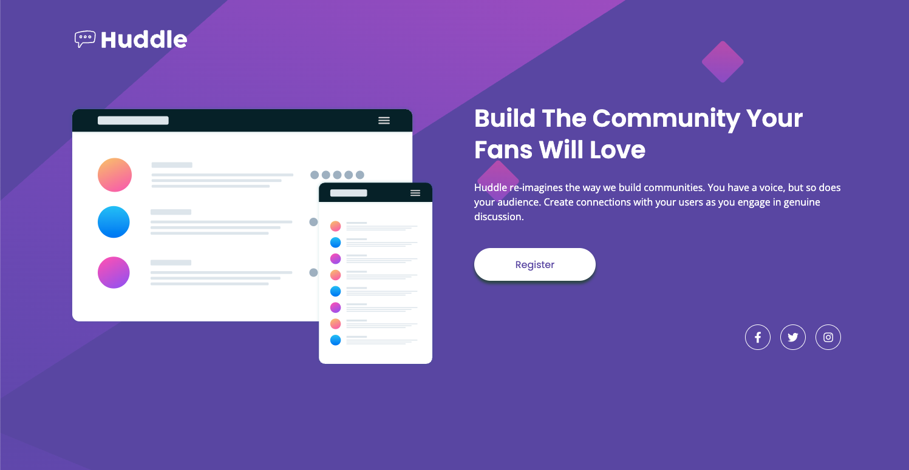

# Frontend Mentor - Huddle landing page with single introductory section solution

This is a solution to the
[Huddle landing page with single introductory section challenge on Frontend Mentor](https://www.frontendmentor.io/challenges/huddle-landing-page-with-a-single-introductory-section-B_2Wvxgi0).
Frontend Mentor challenges help you improve your coding skills by building
realistic projects.

## Table of contents

- [Overview](#overview)
  - [The challenge](#the-challenge)
  - [Screenshot](#screenshot)
  - [Links](#links)
- [My process](#my-process)
  - [Built with](#built-with)
  - [What I learned](#what-i-learned)
  - [Continued development](#continued-development)
  - [Useful resources](#useful-resources)
- [Author](#author)

## Overview

### The challenge

Users should be able to:

- View the optimal layout for the page depending on their device's screen size
- See hover states for all interactive elements on the page

### Screenshot



### Links

- Solution URL: [Repo](https://your-solution-url.com)
- Live Site URL: [See it live!](https://your-live-site-url.com)

## My process

### Built with

- Semantic HTML5 markup
- CSS custom properties (CSS variables)
- Flexbox
- Mobile-first workflow
- Font Awesome icons via CDN
- Custom font loading with @font-face
- Responsive design with media queries

### What I learned

This project helped me practice several key frontend development concepts:

**Responsive Background Images**: I learned how to implement different
background images for different screen sizes while maintaining proper
positioning and scaling.

```css
body {
  background-image: url(../assets/images/bg-mobile.svg);
  background-repeat: no-repeat;
  background-position: center top;
  background-size: contain;
}

@media (min-width: 90rem) {
  body {
    background-image: url(../assets/images/bg-desktop.svg);
    background-size: cover;
    background-position: center;
  }
}
```

**Flexible Layout with Flexbox**: I implemented a responsive layout that changes
from column to row layout on desktop while maintaining proper alignment.

```css
.content-container {
  display: flex;
  flex-direction: column;
  align-items: center;
  text-align: center;
}

@media (min-width: 90rem) {
  .content-container {
    flex-direction: row;
    align-items: center;
    gap: calc(64 / 16 * 1rem);
    text-align: left;
  }
}
```

**CSS Custom Properties for Maintainable Code**: Using CSS variables made it
easy to maintain consistent colors and create reusable design tokens.

```css
:root {
  --c-white: hsl(0, 100%, 100%);
  --c-purple-700: hsl(257, 40%, 49%);
  --c-pink-400: hsl(322, 100%, 66%);
}
```

**Accessible Social Icons**: I implemented social media icons with proper
accessibility features and hover states.

```html
<div class="social-icons">
  <a href="#" aria-label="Facebook">
    <i class="fab fa-facebook-f"></i>
  </a>
  <!-- More icons... -->
</div>
```

### Continued development

Areas I want to continue focusing on in future projects:

- **Advanced CSS Grid**: While this project used Flexbox effectively, I'd like
  to explore more complex layouts with CSS Grid
- **CSS Animations**: Adding subtle animations and transitions to enhance user
  experience
- **Performance Optimization**: Implementing techniques like lazy loading for
  images and optimizing font loading
- **Accessibility**: Further improving keyboard navigation and screen reader
  support

### Useful resources

- [CSS-Tricks Flexbox Guide](https://css-tricks.com/snippets/css/a-guide-to-flexbox/) -
  This comprehensive guide helped me understand Flexbox alignment and
  distribution properties
- [Font Awesome Documentation](https://fontawesome.com/docs) - Essential for
  implementing the social media icons with proper classes and accessibility
- [MDN CSS Media Queries](https://developer.mozilla.org/en-US/docs/Web/CSS/Media_Queries) -
  Helped me understand responsive design breakpoints and media query syntax
- [CSS Custom Properties Guide](https://developer.mozilla.org/en-US/docs/Web/CSS/Using_CSS_custom_properties) -
  Useful for understanding CSS variables and creating maintainable stylesheets

## Author

- Website - [Add your name here](https://www.your-site.com)
- Frontend Mentor -
  [@yourusername](https://www.frontendmentor.io/profile/yourusername)
- Twitter - [@yourusername](https://www.twitter.com/yourusername)
